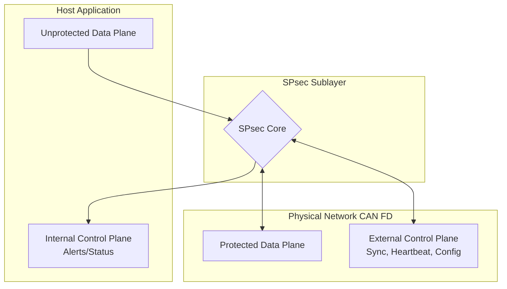

# SPSEC Project

This repository is an implementation of the [SPsec specification](https://cancrypt.net/spsec/) over CAN FD. 
It provides a secure channel over an untrusted CAN network, guaranteeing confidentiality, integrity, and authenticity.
Additional specifications are available at the [CANcrypt resources index](https://cancrypt.net/resources/index.html).

## SPsec Overview
SPsec is designed as a **Small-Packet Network Security Sublayer**. It is primarily targeted at the lowest layer of the automation pyramid—connecting sensors and actuators to control units where traditional internet-style security (which might demand 256-bit overheads) is mathematically impossible due to extreme packet size limitations (e.g., standard CAN or CAN FD frames).

The SPsec architecture divides communication into distinct planes to cleanly isolate security operations from payload forwarding.



## Security Concepts
The protocol defines several roles, primarily the **Participant** (devices participating in secure communication) and the **Sync Role** (providing a counter or timestamp to guarantee uniqueness).

### Key Management Hierarchy
SPsec security operates on various pre-shared keys defined by strict priority and usage boundaries:
1. **Provisioning Key**: Optional device-specific key, usually installed by the manufacturer.
2. **Integrator Key**: Single network system key, installed when the network is first powered up.
3. **Seed Key**: Shared key base updated with every maintenance cycle.
4. **Session Key**: Short-lived key used during time-limited 1:1 sessions (mutual authentication).
5. **Communication Key**: Automatically derived from the Seed key (rolling keys) for secure grouping.

Security mechanisms include 1:1 sessions for mutual authentication (resembling cTLS/TLS-PSK), uniqueness values to prevent replay attacks, and a Secure Heartbeat for injection detection.

## Repository Structure

- **[common/](./common/README.md)**: Shared utilities handling cryptographic primitives, key management, message formatting, and backend abstractions for wolfSSL and mbedTLS.
- **[platform/](./platform/README.md)**: Hardware/OS Abstraction Layer (HAL) providing unified access to underlying requirements like CAN interfaces, non-volatile storage, secure random number generation, and timers.
- **[spsec_can_protocol/](./spsec_can_protocol/README.md)**: Logic mapping the SPsec Sublayer Data and Control planes down to CAN FD frames, satisfying the low-overhead requirements of small-packet serial networks.
- **[spsec_participant/](./spsec_participant/README.md)**: The main SPSEC Participant application, implementing the SPsec roles and state machines (e.g. WAITING, SECURE) while orchestrating the separation of control and data planes.
- **[canopens_configurator_python/](./canopens_configurator_python/README.md)**: Python GUI/CLI tool (`spsec_cli.py`) for provisioning and configuring participants; optional unless you need the configurator or its e2e/GUI tests.

Supporting, non-submodule pieces: `wireshark/spsec.lua` (a Wireshark/tshark dissector for the protocol, see [Testing](#testing)) and `cmake/lpc55s16_toolchain.cmake` (cross-compile toolchain for the LPC55S16 target, see [Build Configuration](#build-configuration)).

## Getting Started

1. **Clone** the repository, then pull the required submodules (the shared
   code is split across several git submodules; `canopens_configurator_python`
   is only needed for the GUI/configurator e2e tests):
   ```bash
   git submodule update --init common platform spsec_participant spsec_can_protocol
   git submodule update --init external/wolfssl   # default crypto backend
   git submodule update --init canopens_configurator_python  # optional, for GUI tests
   ```
2. **Provision CAN interfaces.** For virtual testing run `sudo ./setup_vcan.sh` to create `vcan0` through `vcan10` (the default range; pass a number, e.g. `sudo ./setup_vcan.sh 20`, to raise the top index - the full test suite in `run_all_tests.sh` needs up to `vcan20`). Must be run as root. For hardware, configure your `canX` devices with matching bit rates (2 Mbps data by default).
3. **Build** (CMake 3.19+):
   ```bash
   cmake -B build -S .
   cmake --build build -j$(nproc)
   ```
   This defaults to the wolfSSL backend, AES-GCM, and an 8-byte salt. For other crypto backends, algorithms, salt lengths, or the CMake presets shortcut, see [Build Configuration](#build-configuration).
4. **Run** Run 2 participants and timesync:
   ```bash
   ./build/spsec_participant -s vcan0 -i vcan1 -p 123 -l DEBUG
   ./build/spsec_participant -s vcan0 -i vcan2 -p 124 -l DEBUG
   ./build/spsec_participant -s vcan0 -i vcan3 -t -p 120 -l DEBUG
   ```
5. **Prepare keys.** Supply a dictionary file like `tests/example_keys.txt` with -k if want to test without configuration
   ```bash
   ./build/spsec_participant -s vcan0 -i vcan1 -p 123 -l DEBUG -k tests/example_keys.txt
   ```
   > The bundled `tests/example_keys.txt` holds **public test vectors** only — never ship real keys in-tree.

The participant starts in the `WAITING` state and transitions to `SECURE` after negotiating time and session keys.

6. **Test** To send data from vcan1 to vcan2 over participants run:
   ```bash
   pip install -r tests/requirements.txt
   python ./tests/receive_can_data.py
   python ./tests/send_can_data.py
   ```

## Build Configuration

### Crypto Backend

This project supports two crypto backends. The **default is wolfSSL**.
Your obligations differ depending on which backend you use — see [License](#license).

wolfSSL and mbedTLS are both included as git submodules, and **neither is
initialized by a plain `git submodule update --init`** (which only pulls the
required, non-crypto submodules above) - you pick one crypto backend
explicitly.

**wolfSSL (default).** `run_all_tests.sh` looks for the wolfSSL build at `build/`
(this is the default backend, so no `-DSPSEC_CRYPTO_BACKEND` needed):

```bash
git submodule update --init external/wolfssl
cmake -B build -S .
cmake --build build -j$(nproc)
```

**mbedTLS.** `run_all_tests.sh` picks this up automatically (as an extra CTest phase
alongside the wolfSSL build above) if it finds it at `build_mbedtls/`:

```bash
git submodule update --init external/mbedtls
cmake -B build_mbedtls -S . -DSPSEC_CRYPTO_BACKEND=mbedtls
cmake --build build_mbedtls -j$(nproc)
```

`CMakePresets.json` also defines named presets (`linux-wolfssl`,
`linux-mbedtls`, plus debug/sanitizer/LPC55S16-cross-compile variants) if
you'd rather use `cmake --preset <name>` instead of the flags above - those
build to `build/<preset-name>/` instead of the flat directories shown here, so
point `SPSEC_BUILD_DIR`/`-B` at the right one when combining presets with the
test scripts below.

### Salt Length

The pre-shared/provisioning salt length is a build-time option (`common/include/keys.h`,
`SALT_LEN`, default 8 bytes per the SPsec spec):

```bash
cmake -B build -S . -DSPSEC_SALT_LEN=8            # default, SPsec-spec size
cmake -B build_salt12 -S . -DSPSEC_SALT_LEN=12     # fills the control-plane nonce with no zero-padding
```

(`build_salt12/` is the name `run_all_tests.sh` looks for when adding the 12-byte-salt CTest phase.)

The **participant and configurator must be built with the same `SPSEC_SALT_LEN`**
and use a matching-length salt in their keys file for a given session. (16 bytes was considered and rejected: it behaves identically to 12 in every code path - the extra bytes are never consumed.)

### Algorithm Selection (ASCON-128)

**ASCON-128 does *not* need a longer salt or any other build option** - it works
against the plain default build. The data-plane nonce length is derived
per-algorithm at runtime via `crypto_get_nonce_len(algorithm)` (12 bytes for
AES-GCM/ChaCha20-Poly1305, 16 for ASCON-128), not from a build-time knob.

Select the algorithm at runtime with `spsec_participant --ascon` or `--chacha` (default AES-GCM); the `canopens_configurator` binary needs the same flag for a given session, since AEAD tags are algorithm-specific.

ASCON-128 is only implemented in the wolfSSL backend — a `--ascon` run needs the configurator built with wolfSSL too, even if the participant already defaults to it (see `tests/run_e2e_matrix.sh` for a full worked example across salt lengths, ASCON, and both crypto backends).

## License

This project's source code is licensed under the **BSD 3-Clause License**
regardless of which crypto backend you choose. See [LICENSE](./LICENSE) for
full license text.

The obligations below apply only to **compiled binaries** that you distribute,
and differ depending on which crypto backend you build with:

| Backend | Backend License | Your binary license |
|---|---|---|
| **wolfSSL** (default) | GPLv3 or Commercial | Must be **GPLv3** or requires paid commercial wolfSSL license |
| **mbedTLS** | Apache-2.0 | Remains **BSD 3-Clause** ✅ |

By building with wolfSSL, you accept the terms of its license:
- **Open source (GPLv3):** https://www.wolfssl.com/license/
- **Commercial license:** available at https://www.wolfssl.com/license/ ($7,500/SKU)

mbedTLS is licensed under Apache-2.0, which is fully compatible with BSD 3-Clause.
No additional license obligations apply.

## Testing

`run_all_tests.sh` (repo root; `tests/run_all_tests.sh` is the same file via
symlink) drives the full suite: 40 CMake/CTest unit tests plus 20+
shell-driven end-to-end scenarios (dynamic join/leave, rekeying, code update,
power-cut recovery, multi-algorithm stability, scale tests up to 20 nodes,
and more - see `tests/run_e2e_*.sh` for the full list).

```bash
pip install -r tests/requirements.txt   # python-can, pytest, pycryptodome
pip install -r canopens_configurator_python/requirements.txt  # needed by the pytest phase below
sudo ./setup_vcan.sh 20                 # provisions vcan0..vcan20
./run_all_tests.sh                      # full suite
./run_all_tests.sh --unit-only          # CTest + pytest, skips e2e/vcan - no sudo needed, CI-friendly
```

Some suites are optional and skip cleanly (with a note in the output) when
their tool isn't installed:

| Tool | Needed for |
|---|---|
| `tshark` | `run_wireshark_dissector_test.sh` / the Lua dissector in `wireshark/` |
| `valgrind` | `tests/run_under_valgrind.py` memcheck runs |
| `arm-none-eabi-gcc` (`gcc-arm-none-eabi` package) | `run_cross_compile_lpc55s16.sh` cross-compile smoke test (still fails past the crypto/common layer without the NXP MCUXpresso SDK - set `MCUX_SDK_PATH` to go further; this repo doesn't vendor the SDK) |
| `python3-tk` (system package, not pip) | `run_e2e_gui.sh` / `run_interactive_gui.sh` |

`tests/example_keys_short_salt.txt` / `tests/example_keys_salt12.txt` are the
matching key files for the two `SPSEC_SALT_LEN` build options (see [Build Configuration](#build-configuration)).

## CLI Summary

| Flag                         | Description                                                      | Default  |
| ---------------------------- | ---------------------------------------------------------------- | -------- |
| `-s`, `--secure-if <name>`   | Secure CAN FD interface.                                         | `vcan0`  |
| `-i`, `--insecure-if <name>` | Insecure CAN FD interface.                                       | `vcan1`  |
| `-l`, `--log-level <level>`  | Log verbosity (`DEBUG`, `INFO`, `WARNING`, `ERROR`, `CRITICAL`). | `DEBUG`  |
| `-p`, `--id <0-127>`         | Participant identifier (7-bit).                                  | `123`    |
| `-k`, `--keys_file <path>`   | Key dictionary file (required for secure sessions).              | _unset_  |
| `-t`, `--timesync`           | Enable time authority role.                                      | Disabled |
